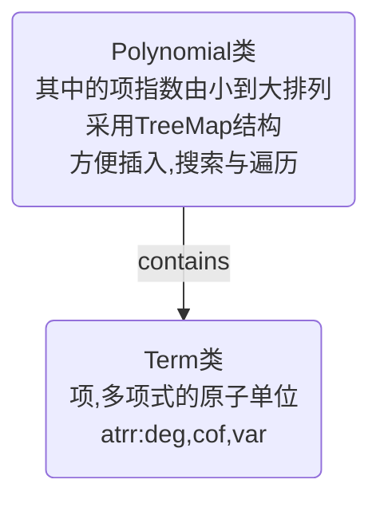
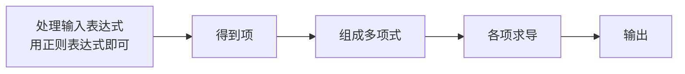

# 主要结构

```mermaid
graph TD

A(Polynomial类<br>其中的项指数由小到大排列<br>采用TreeMap结构<br>方便插入,搜索与遍历)

B(Term类<br>项,多项式的原子单位<br>atrr:deg,cof,var)

A -->|contains| B
```

# 一般流程

```mermaid
graph LR

A[处理输入表达式<br>用正则表达式即可]

B[得到项]

C[组成多项式]

D[各项求导]

E[输出]

A --> B --> C --> D --> E
```
